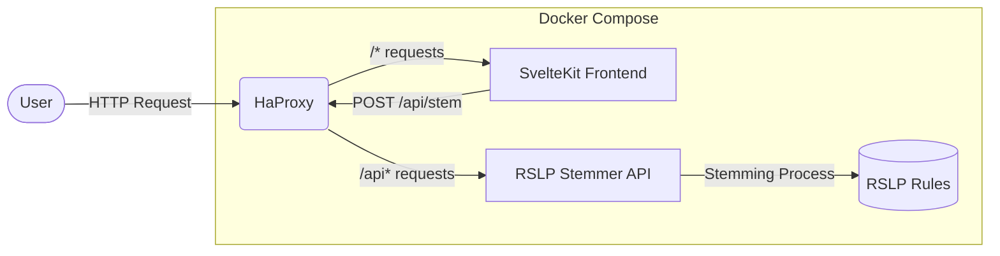

# RSLP Checker


This application provides a user interface and API for the RSLP (Portuguese Language Suffix Remover) algorithm, which is used to remove suffixes from Portuguese words in applications such as search engines, text analysis, and natural language processing.

## System Architecture



## RSLP Process Flow

This flowchart illustrates the steps involved in the RSLP algorithm for stemming Portuguese words, based on this article: [RSLP Stemmer (Removedor de Sufixos da Lingua Portuguesa)](https://www.inf.ufrgs.br/~viviane/rslp):

```mermaid
flowchart LR
    Start([Begin]) --> wordEndsInPlural{Word ends in &quot;s&quot;?}
    wordEndsInPlural -- Yes --> pluralReduction[Plural Reduction]
    wordEndsInPlural -- No --> wordEndsInFeminine{Word ends in &quot;a&quot;?}
    pluralReduction --> wordEndsInFeminine
    wordEndsInFeminine -- Yes --> feminineReduction[Feminine Reduction]
    wordEndsInFeminine -- No --> augmentativeDiminutive{Word ends in &quot;ão&quot; or &quot;inho&quot;?}
    feminineReduction --> augmentativeDiminutive
    augmentativeDiminutive --> adverbReduction[Adverb Reduction]
    adverbReduction --> nounSuffixReduction[Noun Reduction]
    nounSuffixReduction --> isSuffixRemoved{Suffix removed}
    isSuffixRemoved -- Yes --> removeAccents[Remove Accent]
    isSuffixRemoved -- No --> verbSuffixReduction[Verb Reduction]
    verbSuffixReduction --> isSuffixRemoved2{Suffix removed}
    isSuffixRemoved2 -- Yes --> removeAccents
    isSuffixRemoved2 -- No --> removeVowel[Remove Vowel]
    removeVowel --> removeAccents
    removeAccents --> final([End])
```



## Features

- **Frontend**: Built with SvelteJS and TailwindCSS, providing a modern and responsive user interface.
- **Backend**: Developed in TypeScript using Bun, which handles the API requests via [ElysiaJS](https://elysiajs.com) and implements the RSLP algorithm.

## How to Use

The application was built with Docker in mind. To run the application, you need to have Docker installed on your machine. After installing Docker, you can follow these steps:

```sh
docker compose -f local.docker-compose.yml up
```
> This will build and start the application using the provided Docker Compose configuration for local development. If you want a remote-ready setup, use `remote.docker-compose.yml` instead.

This will start the application in the background. After that, you can access the application through your browser at http://localhost.

## API Reference

### User Interface

`GET /`

The main web interface where you can interactively test the RSLP algorithm by entering Portuguese words and seeing their stemmed results.

### REST API

#### Stem a Word

```
POST /api/stem
```

Stems a Portuguese word by removing its suffixes according to the RSLP algorithm.

**Request Body:**

```json
{
  "text": "string"
}
```

**Parameters:**

| Name | Type   | Required | Description                     |
|------|--------|----------|---------------------------------|
| text | string | Yes      | The word to be stemmed          |

**Response:**

```json
{
  "original": "string",
  "stemmed": "string"
}
```

### Examples

#### Single Word Example

Request:
```sh
curl -X POST http://localhost/api/stem \
  -H "Content-Type: application/json" \
  -d '{"text": "caminhando"}'
```

Response:
```json
{
  "original": "caminhando",
  "stemmed": "caminh"
}
```

#### Multiple Words Example

Request:
```sh
curl -X POST http://localhost/api/stem \
  -H "Content-Type: application/json" \
  -d '{"text": "brasileiros aprendendo português"}'
```

Response:
```json
{
  "original": "brasileiros aprendendo português",
  "stemmed": "brasil aprend portug"
}
```

## RSLP Algorithm Overview

The RSLP (Removedor de Sufixos da Língua Portuguesa) algorithm reduces Portuguese words to their stem form by removing suffixes through a series of rule-based steps:

1. **Plural Reduction**: Removes plural endings (e.g., "casas" → "casa")
2. **Adverb Reduction**: Removes adverb suffixes (e.g., "felizmente" → "feliz")
3. **Feminine Reduction**: Converts feminine to masculine forms (e.g., "brasileira" → "brasileir")
4. **Augmentative/Diminutive Reduction**: Removes augmentative/diminutive suffixes (e.g., "cãozinho" → "cã")
5. **Noun Suffix Reduction**: Removes nominal suffixes (e.g., "pensamento" → "pens")
6. **Verb Suffix Reduction**: Removes verbal suffixes (e.g., "caminhando" → "caminh")
7. **Vowel Removal**: Removes final vowels (e.g., "menino" → "menin")
